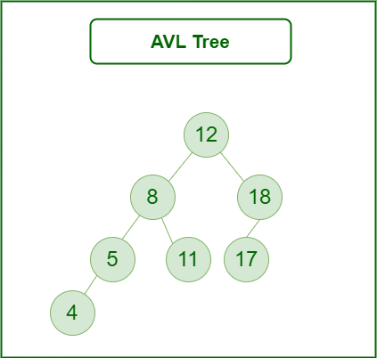
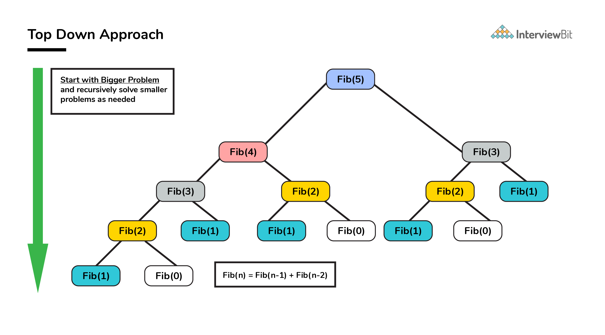
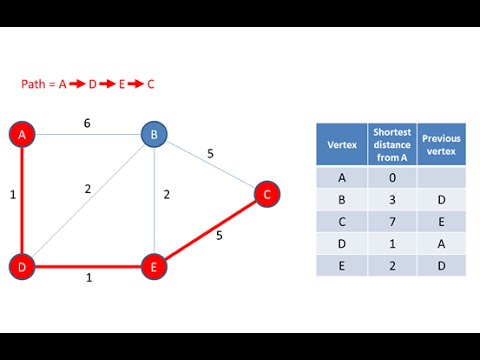

# 🙋🏻 Giriş Dersi

## Algoritma Süreci

- Tasarım (design)
- Doğruluğunu ispat etme (validate)
- Analiz (analysis)
- Uygulama (implementation)
- Test

## Algoritma Tasarım Teknikleri

- Brute Force ( Kaba Kuvvet)

> 

- Divide and Conquer ( Böl ve Yönet)

> 

- Transform and Conquer (Dönüştür ve Yönet)

> 

- Decrease and Conquer (Azalt ve Yönet)
  
> 

- Dynamic Programming (Dinamik Programlama)
  
> 

- Greedy Aproach (Aç Gözlü Yaklaşım)
  
> 
> 

## Algoritma Analizi

- Zaman Karmaşıklığı (Time Complexity)
- Alan Karmaşıklığı (Space Complexity)
