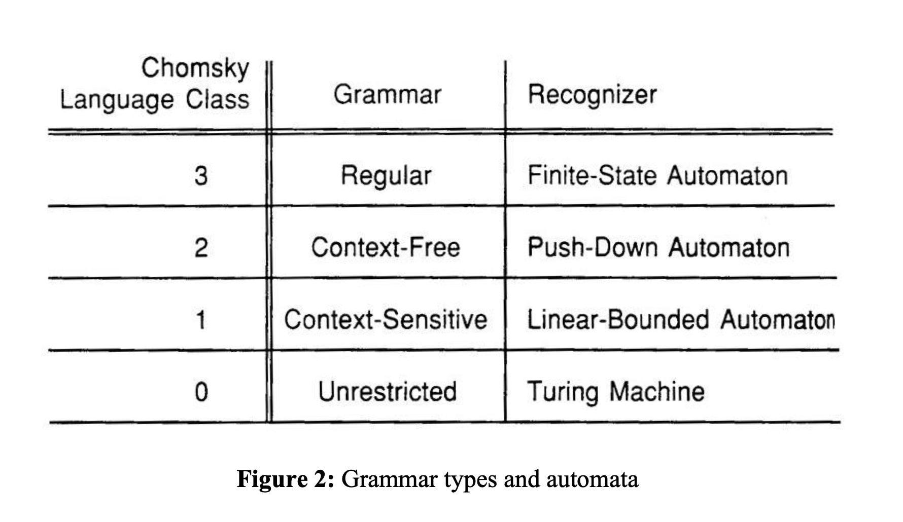
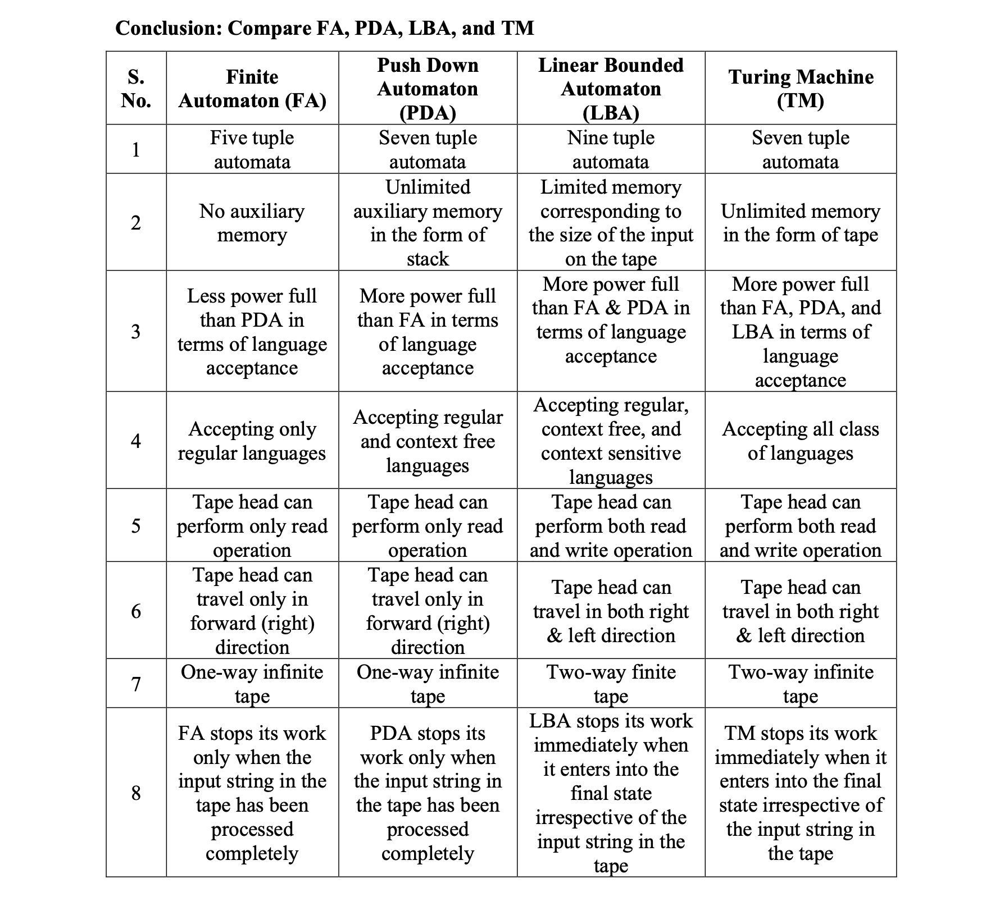

# Biçimsel Diller ve Soyut Makineler

## Biçimsel Diller

- Regular
- Context Free
- Non Context Free
- Hesaplanamayan Diller

## Soyut Makineler (Automata - Özdevinir)

- DFA, NFA, NFA -E
- Pushdown Automata
- LBA (Lineer Bounded Automata)
- Turing Machine

Bir poblem için Turing Makinesi tanımlanabiliyorsa o problem çözülebilirdir.

Von Neumann yapısı ve darboğazı (bottleneck)

Fa - PDA - LBA VE TM kıyaslaması

[Derleyicinin Fazları](https://www.geeksforgeeks.org/phases-of-a-compiler/)

Derleyicinin frontend (ön cepesi)
